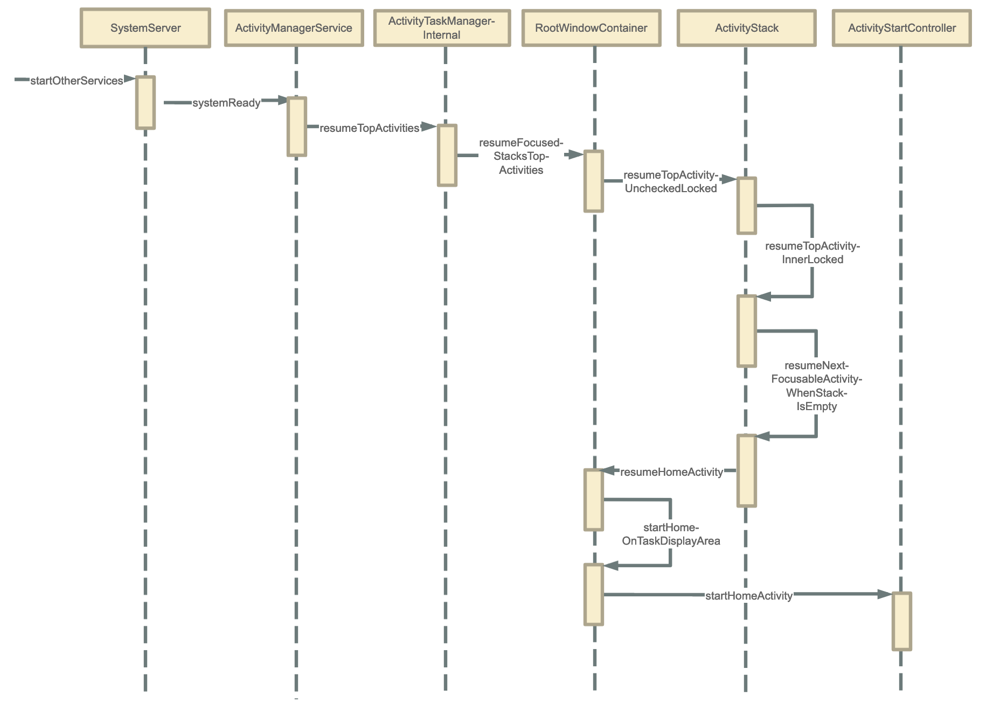

# Android系统启动流程

## 前言

了解Android系统启动，最直接的方式就是拿一台手机，当我们要开机使用时，需要怎么做？这个问题看起来很无知，但凡玩过手机的人都知道，按电源键开机嘛。对，是按电源键开机，屏幕会弹出手机品牌logo，过一会就进入桌面了。这是我们所看到的现象，你可知道其中的缘由吗？虽然现象很简单，过程也很快，但是里面是通过多少个流程走到桌面这一步呢，今天就带大家来分析下这看似简单，但又不简单的启动流程。

既然要分析流程，那我们就从最开始（按电源键开始）来分析，当我们按下电源键，会执行哪些指令，调用哪些流程，一起来看：

有两种按键方式能够启动系统，长按电源键和电源键+音量下键，长按电源键进入的是BootLoader模式，而电源键+音量下键进入的是Recovery模式，我们正常开机一般都通过第一种方式进入。

## Bootloader——第一个程序

当按下电源键或者系统重启的时候，引导芯片会从ROM（这里一般是Flash ROM，即闪存）中预定义的位置将BootLoader加载到RAM中，接着，BootLoader会把linux内核加载到RAM中并启动。


BootLoader是在系统内核运行之前运行的一小段程序，也是系统运行的第一个程序，它的作用如下：

1.初始化RAM（一般指内存）

2.初始化硬件设备

3.加载内核和内存空间影像图

4.跳转到内核

Android系统的启动，也是linux系统的启动。

启动内核时，会执行设置缓存，加载驱动等步骤，然后查找init.rc文件，并启动init进程。

## init进程——1号进程

Linux内核启动过程中会创建init进程，init进程是用户空间的第一个进程（pid=1），对应的源文件为：***system/core/init/main.cpp***，（这里要说明一下，在安卓8、9版本中，init的源文件在***system/core/init/init.cpp***，在安卓10、11以及后的版本里，init源文件迁移到***main.cpp***中）它的main方法如下：

```cpp
int main(int argc, char** argv) {
    #if __has_feature(address_sanitizer)
    __asan_set_error_report_callback(AsanReportCallback);
    #endif

    if (!strcmp(basename(argv[0]), "ueventd")) {
        return ueventd_main(argc, argv);
    }

    if (argc > 1) {
        if (!strcmp(argv[1], "subcontext")) {
            android::base::InitLogging(argv, &android::base::KernelLogger);
            const BuiltinFunctionMap& function_map = GetBuiltinFunctionMap();

            return SubcontextMain(argc, argv, &function_map);
        }

        if (!strcmp(argv[1], "selinux_setup")) {
            return SetupSelinux(argv);
        }

        // 当argc > 1时启动第二阶段函数
        if (!strcmp(argv[1], "second_stage")) {
            return SecondStageMain(argc, argv);
        }
    }

    //启动第一阶段函数
    return FirstStageMain(argc, argv);

}
```

先看下**FirstStageMain**这个函数：在***system/core/init/first_stage_init.cpp***中

```cpp
int FirstStageMain(int argc, char** argv) {

    ...
    
    //创建和挂载启动所需的文件目录
    CHECKCALL(mount("tmpfs", "/dev", "tmpfs", MS_NOSUID, "mode=0755"));
    CHECKCALL(mkdir("/dev/pts", 0755));
    CHECKCALL(mkdir("/dev/socket", 0755));
    CHECKCALL(mount("devpts", "/dev/pts", "devpts", 0, NULL));

	#define MAKE_STR(x) __STRING(x)
    CHECKCALL(mount("proc", "/proc", "proc", 0, "hidepid=2,gid=" MAKE_STR(AID_READPROC)));
	#undef MAKE_STR
    CHECKCALL(chmod("/proc/cmdline", 0440));
   
    ...
        
    CHECKCALL(mount("sysfs", "/sys", "sysfs", 0, NULL));
    CHECKCALL(mount("selinuxfs", "/sys/fs/selinux", "selinuxfs", 0, NULL));

    CHECKCALL(mknod("/dev/kmsg", S_IFCHR | 0600, makedev(1, 11)));

    ...
        
    return 1;

}
```

再看**SecondStageMain**，对应目录在：***system/core/init/init.cpp***

```cpp
int SecondStageMain(int argc, char** argv) {

    //初始化内核日志处理工具
    InitKernelLogging(argv);

    //初始化属性服务
    PropertyInit();

    //启动属性服务
    StartPropertyService(&property_fd);

    //解析init.rc配置文件
    LoadBootScripts(am, sm);

    return 0;

}

static void LoadBootScripts(ActionManager& action_manager, ServiceList& service_list) {
    Parser parser = CreateParser(action_manager, service_list);

    std::string bootscript = GetProperty("ro.boot.init_rc", "");
    if (bootscript.empty()) {
        parser.ParseConfig("/system/etc/init/hw/init.rc");

        ...

    } else {
        parser.ParseConfig(bootscript);
    }
}
```

上面两个阶段都在init进程进行，我们知道init做了一下几件事情：

- 创建和挂载启动所需的文件目录
- 初始化属性服务
- 启动属性服务
- 解析**init.rc**配置文件，启动zygote进程

这里重点看下**init.rc**配置文件，大概内容如下：

```
import /init.environ.rc
import /system/etc/init/hw/init.usb.rc
import /init.${ro.hardware}.rc
import /vendor/etc/init/hw/init.${ro.hardware}.rc
import /system/etc/init/hw/init.usb.configfs.rc
import /system/etc/init/hw/init.${ro.zygote}.rc

on early-init
    write /proc/sys/kernel/sysrq 0
    write /proc/sys/kernel/modprobe \n
    ...
    
service console /system/bin/sh
    class core
    console
    disabled
    user shell
    group shell log readproc
    seclabel u:r:shell:s0
    setenv HOSTNAME console

on property:ro.debuggable=1
    chmod 0773 /data/misc/trace
    chmod 0775 /data/misc/wmtrace
    
...
```

rc文件由Android初始化语言编写，rc文件主要包含Action、Service、Command、Options等，这些操作都由特殊的命令组成。

在开头几行代码中，import导入了几个rc文件，事实上，在 ***system/core/rootdir***目录下有多个init.xxx.rc文件，其中xxx有zygote32和zygote64等，这是因为在不同的硬件环境下，需要导入相应的配置文件，比如在64位操作系统中，init.zygote64.rc文件会被导入，它的内容如下：

```
service zygote /system/bin/app_process64 -Xzygote /system/bin --zygote --start-system-server
    class main
    priority -20
    user root
    group root readproc reserved_disk
    socket zygote stream 660 root system
    socket usap_pool_primary stream 660 root system
    onrestart exec_background - system system -- /system/bin/vdc volume abort_fuse
    onrestart write /sys/power/state on
    onrestart restart audioserver
    onrestart restart cameraserver
    onrestart restart media
    onrestart restart netd
    onrestart restart wificond
    writepid /dev/cpuset/foreground/tasks
```

这几行代码表示启动一个名字为zygote、执行文件路径为：/system/bin/app_process64、参数为-Xzygote /system/bin --zygote --start-system-server的进程。

除了zygote进程，还有许多关键进程都是由init进程通过读取相应的rc文件进行启动的，如 servicemanager、surfaceflinger 和 mediaserver 进程等等，这些进程都是保证系统运行必不可少的。至于这些进程是如何启动的今天先不做出讲解，后续会针对性讲解。

## Zygote进程——Java进程的始祖

上面说了init进程会解析配置文件，启动zygote进程，那什么是zygote进程呢？

Zygote又称孵化器，用于创建DVM和ART、应用程序进程以及运行系统关键服务的SystemServer进程

### 工作原理

通过fork的形式来创建应用程序进程和SystemServer进程， Zygote的 Java框架层中会创建一个Server端的Socket，这个Socket用来等待AMS请求Zygote来创建新的应用程序进程。

#### 启动

Zygote启动是在init.rc配置文件里面调用 的，通过ro.zygote的属性选择引入脚本，主方法是main方法。

```
on nonencrypted
    class_start main
    class_start late_start
```

我们直接进入源码看：在***frameworks/base/cmds/app_process/app_main.cpp***中：

```cpp
int main(int argc, char* const argv[])
{
    ...

        AppRuntime runtime(argv[0], computeArgBlockSize(argc, argv));

    ...

        if (zygote) {
            //调用AppRuntime的父类AndroidRuntime的start方法启动zygote进程
            runtime.start("com.android.internal.os.ZygoteInit", args, zygote);
        } else if (className) {
            runtime.start("com.android.internal.os.RuntimeInit", args, zygote);
        } else {
            fprintf(stderr, "Error: no class name or --zygote supplied.\n");
            app_usage();
            LOG_ALWAYS_FATAL("app_process: no class name or --zygote supplied.");
        }
}
```
来看看start做什么事情：在***frameworks/base/core/jni/AndroidRuntime.cpp***：


```cpp
void AndroidRuntime::start(const char* className, const Vector<String8>& options, bool zygote)
{
   ...
       
    /* start the virtual machine */
    JniInvocation jni_invocation;
    jni_invocation.Init(NULL);
    JNIEnv* env;
    //启动JVM
    if (startVm(&mJavaVM, &env, zygote, primary_zygote) != 0) {
        return;
    }
    onVmCreated(env);
    
    //为JVM虚拟机注册JNI方法
    if (startReg(env) < 0) {
        ALOGE("Unable to register all android natives\n");
        return;
    }
    
    jclass stringClass;
    jobjectArray strArray;
    jstring classNameStr;

    stringClass = env->FindClass("java/lang/String");
    assert(stringClass != NULL);
    //创建数组
    strArray = env->NewObjectArray(options.size() + 1, stringClass, NULL);
    assert(strArray != NULL);
    //从app_main的main函数得知classNameStr为：com.android.internal.os.ZygoteInit
    classNameStr = env->NewStringUTF(className);
    assert(classNameStr != NULL);
    env->SetObjectArrayElement(strArray, 0, classNameStr);

    for (size_t i = 0; i < options.size(); ++i) {
        jstring optionsStr = env->NewStringUTF(options.itemAt(i).string());
        assert(optionsStr != NULL);
        env->SetObjectArrayElement(strArray, i + 1, optionsStr);
    }

    char* slashClassName = toSlashClassName(className != NULL ? className : "");
    jclass startClass = env->FindClass(slashClassName);
    if (startClass == NULL) {
        ALOGE("JavaVM unable to locate class '%s'\n", slashClassName);
        /* keep going */
    } else {
        //找到ZygoteInit的main函数
        jmethodID startMeth = env->GetStaticMethodID(startClass, "main",
            "([Ljava/lang/String;)V");
        if (startMeth == NULL) {
            ALOGE("JavaVM unable to find main() in '%s'\n", className);
            /* keep going */
        } else {
            //通过JNI调用ZygoteInit的main函数
            env->CallStaticVoidMethod(startClass, startMeth, strArray);

#if 0
            if (env->ExceptionCheck())
                threadExitUncaughtException(env);
#endif
        }
    } 
   ...
}
```

这里是一个JNI调用，我们知道是在ZygoteInit中，这肯定是一个java文件了，来看在它哪里：

***frameworks/base/core/java/com/android/internal/os/ZygoteInit.java***

```java
public static void main(String argv[]) {

    try {
        if (!enableLazyPreload) {
            ...
                //预加载类和资源
                preload(bootTimingsTraceLog);
            ...
        }

        //创建Server端socket
        zygoteServer = new ZygoteServer(isPrimaryZygote);
        ...
            Log.i(TAG, "Accepting command socket connections");

        if (startSystemServer) {
            //启动system_server进程
            Runnable r = forkSystemServer(abiList, zygoteSocketName, zygoteServer);
            if (r != null) {
                r.run();
                return;
            }
        } 
        //等待AMS请求
        caller = zygoteServer.runSelectLoop(abiList);
    } catch (Throwable ex) {
        Log.e(TAG, "System zygote died with exception", ex);
        throw ex;
    } finally {
        if (zygoteServer != null) {
            zygoteServer.closeServerSocket();
        }
    }
    
    if (caller != null) {
        caller.run();
    }
}
```

通过zygoteServer来执行runSelectLoop，看到caller.run()，可知这是一个Runnable，进ZygoteServer看下：***frameworks/base/core/java/com/android/internal/os/ZygoteServer.java***

```java
ZygoteServer(boolean isPrimaryZygote) {
    mUsapPoolEventFD = Zygote.getUsapPoolEventFD();

    if (isPrimaryZygote) {
        //创建Socket客户端
        mZygoteSocket = Zygote.createManagedSocketFromInitSocket(Zygote.PRIMARY_SOCKET_NAME);
        mUsapPoolSocket =
                Zygote.createManagedSocketFromInitSocket(
                        Zygote.USAP_POOL_PRIMARY_SOCKET_NAME);
    } else {
        mZygoteSocket = Zygote.createManagedSocketFromInitSocket(Zygote.SECONDARY_SOCKET_NAME);
        mUsapPoolSocket =
                Zygote.createManagedSocketFromInitSocket(
                        Zygote.USAP_POOL_SECONDARY_SOCKET_NAME);
    }

    mUsapPoolSupported = true;
    fetchUsapPoolPolicyProps();
}
```

```java
Runnable runSelectLoop(String abiList) {
    ArrayList<FileDescriptor> socketFDs = new ArrayList<>();
    ArrayList<ZygoteConnection> peers = new ArrayList<>();

    //这里的mZygoteSocket就是刚刚创建的服务端ocket
    socketFDs.add(mZygoteSocket.getFileDescriptor());
    peers.add(null);

    mUsapPoolRefillTriggerTimestamp = INVALID_TIMESTAMP;

    //循环读取状态
    while (true) {
        fetchUsapPoolPolicyPropsWithMinInterval();
        mUsapPoolRefillAction = UsapPoolRefillAction.NONE;

        int[] usapPipeFDs = null;
        StructPollfd[] pollFDs;

        ...
            
        int pollIndex = 0;
        for (FileDescriptor socketFD : socketFDs) {
            pollFDs[pollIndex] = new StructPollfd();
            pollFDs[pollIndex].fd = socketFD;
            pollFDs[pollIndex].events = (short) POLLIN;
            ++pollIndex;
        }

        final int usapPoolEventFDIndex = pollIndex;

        while (--pollIndex >= 0) {
            //读取的状态不是客户端连接或者数据请求时，进入下一次循环
            if ((pollFDs[pollIndex].revents & POLLIN) == 0) {
                continue;
            }
            if (pollIndex == 0) { //表示跟客户端Socket 连接上了
                ZygoteConnection newPeer = acceptCommandPeer(abiList);
                peers.add(newPeer);
                socketFDs.add(newPeer.getFileDescriptor());

            } else if (pollIndex < usapPoolEventFDIndex) { //这里的usapPoolEventFDIndex为socketFD的个数

                try {
                    //表示接收到客户端发过来的请求
                    ZygoteConnection connection = peers.get(pollIndex);
                    //processOneCommand方法创建一个新的应用程序进程
                    final Runnable command = connection.processOneCommand(this);

                    if (mIsForkChild) {     
                        if (command == null) {
                            throw new IllegalStateException("command == null");
                        }

                        return command;
                    } else {    
                        if (command != null) {
                            throw new IllegalStateException("command != null");
                        }
                        ...
                    }
                }
            }
            ...
        }
    }
}
```

这里进入了ZygoteConnection这个类中，具体目录在：***frameworks/base/core/java/com/android/internal/os/ZygoteConnection.java***

```java
Runnable processOneCommand(ZygoteServer zygoteServer) {
    String[] args;

    try {
        //读取socket客户端发送过来的参数列表
        args = Zygote.readArgumentList(mSocketReader);
    } catch (IOException ex) {
        throw new IllegalStateException("IOException on command socket", ex);
    }

    ...

        //将 socket 客户端传递过来的参数，解析成 Arguments 对象格式
        ZygoteArguments parsedArgs = new ZygoteArguments(args);
    ...
        //同样调用Zygote的forkAndSpecialize方法fork出子进程
        pid = Zygote.forkAndSpecialize(parsedArgs.mUid, parsedArgs.mGid, parsedArgs.mGids,
                                       parsedArgs.mRuntimeFlags, rlimits, parsedArgs.mMountExternal, parsedArgs.mSeInfo,
                                       parsedArgs.mNiceName, fdsToClose, fdsToIgnore, parsedArgs.mStartChildZygote,
                                       parsedArgs.mInstructionSet, parsedArgs.mAppDataDir, parsedArgs.mIsTopApp,
                                       parsedArgs.mPkgDataInfoList, parsedArgs.mWhitelistedDataInfoList,
                                       parsedArgs.mBindMountAppDataDirs, parsedArgs.mBindMountAppStorageDirs);

    try {
        if (pid == 0) {
            // in child
            zygoteServer.setForkChild();
            
            zygoteServer.closeServerSocket();
            IoUtils.closeQuietly(serverPipeFd);
            serverPipeFd = null;
			
            //进入子进程流程
            return handleChildProc(parsedArgs, childPipeFd, parsedArgs.mStartChildZygote);
        } else {
            // In the parent. A pid < 0 indicates a failure and will be handled in
            // handleParentProc.
            IoUtils.closeQuietly(childPipeFd);
            childPipeFd = null;
            //进入父进程流程
            handleParentProc(pid, serverPipeFd);
            return null;
        }
    } finally {
        IoUtils.closeQuietly(childPipeFd);
        IoUtils.closeQuietly(serverPipeFd);
    }
}
```

至此， Zygote启动的全部流程已经走完，接下来就是进入到system_server进程了。

#### 总结：

Zygote进程启动做了哪些事情：

- 创建AppRuntime（继承自AndroidRuntime），并调用它的**start**方法。
- 在AndroidRuntime中，启动JVM虚拟机，并注册JNI方法，通过JNI调用进入ZygoteInit的**main**函数（第一次进入Java的世界）
- 通过**ZygoteServer**构造函数建立Socket通道，使Zygote进程成为socket服务端。并通过**runSelectLoop()** 函数等待AMS 发送请求创建新的应用程序进程。
- 调用**forkSystemServer**()函数fork出system_server进程。

## system_server进程

**system_server进程承载了framework层的核心业务。**

system_server进程由zygote启动，用于创建AMS、WMS、PMS等系统服务。

接下来我们一起通过源码分析下system_server进程的启动过程和执行过程。

### system_server进程的启动过程

上面我们已经知道，zgyote进程在启动的时候会通过forkSystemServer来fork出一个叫system_server的进程，返回一个Runnable，来看代码：

```java
private static Runnable forkSystemServer(String abiList, String socketName,
        ZygoteServer zygoteServer) {
   
    //启动system_server的命令行参数
    String args[] = {
            "--setuid=1000",
            "--setgid=1000",
            "--setgroups=1001,1002,1003,1004,1005,1006,1007,1008,1009,1010,1018,1021,1023,"
                    + "1024,1032,1065,3001,3002,3003,3006,3007,3009,3010,3011",
            "--capabilities=" + capabilities + "," + capabilities,
            "--nice-name=system_server",
            "--runtime-args",
            "--target-sdk-version=" + VMRuntime.SDK_VERSION_CUR_DEVELOPMENT,
            "com.android.server.SystemServer",
    };
    ZygoteArguments parsedArgs = null;

    int pid;

   	...
        
        /* Request to fork the system server process */
        pid = Zygote.forkSystemServer(
                parsedArgs.mUid, parsedArgs.mGid,
                parsedArgs.mGids,
                parsedArgs.mRuntimeFlags,
                null,
                parsedArgs.mPermittedCapabilities,
                parsedArgs.mEffectiveCapabilities);
    } catch (IllegalArgumentException ex) {
        throw new RuntimeException(ex);
    }

    /* For child process */
    if (pid == 0) {
        if (hasSecondZygote(abiList)) {
            waitForSecondaryZygote(socketName);
        }

        zygoteServer.closeServerSocket();
        return handleSystemServerProcess(parsedArgs);
    }

    return null;
}
```

最终返回了handleSystemServerProcess方法。

```java
private static Runnable handleSystemServerProcess(ZygoteArguments parsedArgs) {
	
    ...

    if (parsedArgs.mInvokeWith != null) {
       
        ...
           
    } else {
        ClassLoader cl = null;
        if (systemServerClasspath != null) {
            cl = createPathClassLoader(systemServerClasspath, parsedArgs.mTargetSdkVersion);

            Thread.currentThread().setContextClassLoader(cl);
        }

        /*
         * Pass the remaining arguments to SystemServer.
         */
        return ZygoteInit.zygoteInit(parsedArgs.mTargetSdkVersion,
                parsedArgs.mDisabledCompatChanges,
                parsedArgs.mRemainingArgs, cl);
    }

    /* should never reach here */
}
```

```java
public static final Runnable zygoteInit(int targetSdkVersion, long[] disabledCompatChanges,
        String[] argv, ClassLoader classLoader) {
    if (RuntimeInit.DEBUG) {
        Slog.d(RuntimeInit.TAG, "RuntimeInit: Starting application from zygote");
    }

    Trace.traceBegin(Trace.TRACE_TAG_ACTIVITY_MANAGER, "ZygoteInit");
    RuntimeInit.redirectLogStreams();

    RuntimeInit.commonInit();
    //通过Native层中AndroidRuntime.cpp的JNI方法最终调用app_main.cpp的onZygoteInit方法，
    //启动Binder线程池，使system_server进程可以使用Binder与其他进程通信
    ZygoteInit.nativeZygoteInit();
    //继续往下调用
    return RuntimeInit.applicationInit(targetSdkVersion, disabledCompatChanges, argv,
            classLoader);
}
```

进入RuntimeInit的applicationInit方法看下：

```java
protected static Runnable applicationInit(int targetSdkVersion, long[] disabledCompatChanges,
        String[] argv, ClassLoader classLoader) {
   
  ...
      
    return findStaticMain(args.startClass, args.startArgs, classLoader);
}
```

调用findStaticMain：

```java
protected static Runnable findStaticMain(String className, String[] argv,
        ClassLoader classLoader) {
    Class<?> cl;

    try {
        // 通过反射得到SystemServer类
        cl = Class.forName(className, true, classLoader);
    } catch (ClassNotFoundException ex) {
        throw new RuntimeException(
                "Missing class when invoking static main " + className,
                ex);
    }

    Method m;
    try {
        //从SystemServer类中拿到main方法
        m = cl.getMethod("main", new Class[] { String[].class });
    } catch (NoSuchMethodException ex) {
        throw new RuntimeException(
                "Missing static main on " + className, ex);
    } catch (SecurityException ex) {
        throw new RuntimeException(
                "Problem getting static main on " + className, ex);
    }

    int modifiers = m.getModifiers();
    if (! (Modifier.isStatic(modifiers) && Modifier.isPublic(modifiers))) {
        throw new RuntimeException(
                "Main method is not public and static on " + className);
    }
    /*
    	 * This throw gets caught in ZygoteInit.main(), which responds
         * by invoking the exception's run() method. This arrangement
         * clears up all the stack frames that were required in setting
         * up the process.
         */
    return new MethodAndArgsCaller(m, argv);
}
```

```java
static class MethodAndArgsCaller implements Runnable {
    /** method to call */
    private final Method mMethod;

    /** argument array */
    private final String[] mArgs;

    public MethodAndArgsCaller(Method method, String[] args) {
        mMethod = method;
        mArgs = args;
    }

    public void run() {
        try {
            // 调用传递过来的mMethod
            mMethod.invoke(null, new Object[] { mArgs });
        } catch (IllegalAccessException ex) {
            throw new RuntimeException(ex);
        } catch (InvocationTargetException ex) {
            Throwable cause = ex.getCause();
            if (cause instanceof RuntimeException) {
                throw (RuntimeException) cause;
            } else if (cause instanceof Error) {
                throw (Error) cause;
            }
            throw new RuntimeException(ex);
        }
    }
}
```

这样，system_sever进程就启动起来了，并且进入了SystemServer.java的main方法。

注意一下上面那段注释：

> This throw gets caught in ZygoteInit.main(), which responds by invoking the exception's run() method. This arrangement clears up all the stack frames that were required in setting up the process.

在最新的版本里，将MethodAndArgsCaller对象作为返回值返回，最后在ZygoteInit的caller.run()方法里，这个每个方法都执行了返回过程，自然在堆栈中对应的栈帧也被弹出栈了。

```java
if (caller != null) {
    caller.run();
}
```

### system_server进程的执行过程

在： ***frameworks/base/services/java/com/android/server/SystemServer.java***

```java
/**
 * The main entry point from zygote.
 */
public static void main(String[] args) {
    new SystemServer().run();
}
```

我们从注释中也能看到：这个是进入system_server进程的入口，调用run()方法

```java
private void run() {
    
    ...
        
    // 加载libandroid_servers.so
    System.loadLibrary("android_servers");
    
    ...
    // 创建 SystemContext
    createSystemContext();
        
    // 创建 SystemServiceManager
    mSystemServiceManager = new SystemServiceManager(mSystemContext);
    LocalServices.addService(SystemServiceManager.class, mSystemServiceManager);       SystemServerInitThreadPool.start();
    
    ...
        
    // Start services.
    try {
        t.traceBegin("StartServices");
        //启动引导服务
        startBootstrapServices(t);
        //启动核心服务
        startCoreServices(t);
        //启动其他服务
        startOtherServices(t);
    } catch (Throwable ex) {
        ...
    } finally {
        t.traceEnd(); // StartServices
    }
    
    ...
        
}
```

可以看到，在run方法中，主要执行了启动引导服务、核心服务、其他服务的任务，下面通过表格列举一些服务：

|          引导服务           |                             作用                             |
| :-------------------------: | :----------------------------------------------------------: |
|          Installer          | 系统安装apk时的一个服务类，启动完成Installer服务之后才能启动其他的系统服务 |
|   ActivityManagerService    |               负责四大组件的启动、切换、调度。               |
|     PowerManagerService     |    计算系统中和Power相关的计算，然后决策系统应该如何反应     |
|    DisplayManagerService    |                     用来管理所有显示设备                     |
|     UserManagerService      |                        多用户模式管理                        |
|        SensorService        |                   为系统提供各种感应器服务                   |
|    PackageManagerService    |         用来对apk进行安装、解析、删除、卸载等等操作          |
|        LightsService        |                      管理和显示背光LED                       |
|        **核心服务**         |                                                              |
|       BatteryService        |                      管理电池相关的服务                      |
|      UsageStatsService      |            收集用户使用每一个APP的频率、使用时常             |
|    WebViewUpdateService     |                       WebView更新服务                        |
|        **其他服务**         |                                                              |
|        CameraService        |                        摄像头相关服务                        |
|     AlarmManagerService     |                      全局定时器管理服务                      |
|     InputManagerService     |                         管理输入事件                         |
|    WindowManagerService     |                         窗口管理服务                         |
|      VrManagerService       |                        VR模式管理服务                        |
|      BluetoothService       |                         蓝牙管理服务                         |
| NotificationManagerService  |                         通知管理服务                         |
| DeviceStorageMonitorService |                       存储相关管理服务                       |
|   LocationManagerService    |                         定位管理服务                         |
|        AudioService         |                       音频相关管理服务                       |

通过上面的流程，system_server进程就启动起来了，并且启动了各种服务。

#### 总结：

system_server进程在启动过程中完成的工作分别是：

- 启动Binder线程池，建立进程间通信。
- 创建 SystemServiceManager，用于对系统服务进行创建、启动和生命周期管理。
- 启动引导服务、核心服务、其他服务等。

## Launcher——Android系统的 “桌面”


如果你不知道什么是Launcher的话，看到上面的页面就应该知道了，Launcher其实就是桌面，是一个系统app，桌面上的图标则是启动器，我们可以通过这些图标启动对应的app。

### Launcher的启动

上文中我们知道 Zygote进程启动了SystemServer进程，而启动Launcher的入口为AMS的systemReady方法，在SystemServer的startOtherServices方法中被调用，我们看下startOtherServices：

```java
private void startOtherServices(@NonNull TimingsTraceAndSlog t) {
    
    ...
        
     mActivityManagerService.systemReady(() -> {
            Slog.i(TAG, "Making services ready");
            t.traceBegin("StartActivityManagerReadyPhase");
            mSystemServiceManager.startBootPhase(t, SystemService.PHASE_ACTIVITY_MANAGER_READY);
          
         ...
     })
}                                         
```

调用AMS的systemReady()方法，我们进入AMS看下：

***frameworks/base/services/core/java/com/android/server/am/ActivityManagerService.java***

```java
 public void systemReady(final Runnable goingCallback, @NonNull TimingsTraceAndSlog t) {
     ...
         
     t.traceBegin("resumeTopActivities");
     mAtmInternal.resumeTopActivities(false /* scheduleIdle */);
     t.traceEnd();
     
     ...
         
 }
```

**这个地方各版本有差异**：

> 在安卓8、9版本上是通过调用ActivityStackSupervisor的resumeFocusedStackTopActivityLocked（）方法
>
> 而安卓10、11版本里则是交给了ActivityTaskManagerInternal，通过调用resumeTopActivities（）方法。

我是整体基于Android11分析的流程，所以对前面版本感兴趣的同学，可以下载对应的源码来深入了解，现在我们进入resumeTopActivities方法看下：

***frameworks/base/services/core/java/com/android/server/wm/ActivityTaskManagerInternal.java***

```java
public abstract class ActivityTaskManagerInternal {
    ...
    public abstract void resumeTopActivities(boolean scheduleIdle);
	...
}
```

这是一个抽象类，那它的实现类在哪里呢？我们注意到在AMS的构造方法中：

```java
mAtmInternal = LocalServices.getService(ActivityTaskManagerInternal.class);
```

LocalServices类里面是一个类与对象的键值对，我们找到它的唯一继承类ActivityTaskManagerService.LocalService

***frameworks/base/services/core/java/com/android/server/wm/ActivityTaskManagerService.java***

```java
public class ActivityTaskManagerService extends IActivityTaskManager.Stub {
    ...
        RootWindowContainer mRootWindowContainer;
        final class LocalService extends ActivityTaskManagerInternal {
            ...
                @Override
                public void resumeTopActivities(boolean scheduleIdle) {
                synchronized (mGlobalLock) {
                    mRootWindowContainer.resumeFocusedStacksTopActivities();
                    if (scheduleIdle) {
                        mStackSupervisor.scheduleIdle();
                    }
                }
            }
            
            ...
        }
}
```

这里调用了RootWindowContainer的resumeFocusedStacksTopActivities方法

```java
boolean resumeFocusedStacksTopActivities(
        ActivityStack targetStack, ActivityRecord target, ActivityOptions targetOptions) {
	
    ...

    for (int displayNdx = getChildCount() - 1; displayNdx >= 0; --displayNdx) {
        boolean resumedOnDisplay = false;
		
       ...
           
        if (!resumedOnDisplay) {
           
            final ActivityStack focusedStack = display.getFocusedStack();
            if (focusedStack != null) {
                result |= focusedStack.resumeTopActivityUncheckedLocked(target, targetOptions);
            } else if (targetStack == null) {
                result |= resumeHomeActivity(null /* prev */, "no-focusable-task",
                        display.getDefaultTaskDisplayArea());
            }
        }
    }

    return result;
}
```

这里看下：**当focusedStack为null时，直接启动resumeHomeActivity。**

接下来又走到了ActivityStack：

```java
boolean resumeTopActivityUncheckedLocked(ActivityRecord prev, ActivityOptions options) {
    ...
  
    result = resumeTopActivityInnerLocked(prev, options);
	
    ...

    return result;
}

private boolean resumeTopActivityInnerLocked(ActivityRecord prev, ActivityOptions options) {
    
    ...
        if (!hasRunningActivity) {
            // There are no activities left in the stack, let's look somewhere else.
            return resumeNextFocusableActivityWhenStackIsEmpty(prev, options);
        }
    ...
}
```

又调用了resumeNextFocusableActivityWhenStackIsEmpty：

```java
private boolean resumeNextFocusableActivityWhenStackIsEmpty(ActivityRecord prev,
        ActivityOptions options) {
  ....
      
    return mRootWindowContainer.resumeHomeActivity(prev, reason, getDisplayArea());
}
```

兜兜转转，又返回到RootWindowContainer类中，调用了resumeHomeActivity方法，我们回到这个类 看下：

***frameworks/base/services/core/java/com/android/server/wm/RootWindowContainer.java***

```java
boolean resumeHomeActivity(ActivityRecord prev, String reason,
        TaskDisplayArea taskDisplayArea) {
   ...
       
    return startHomeOnTaskDisplayArea(mCurrentUser, myReason, taskDisplayArea,
            false /* allowInstrumenting */, false /* fromHomeKey */);
}
```

走到了startHomeOnTaskDisplayArea方法

```java
boolean startHomeOnTaskDisplayArea(int userId, String reason, TaskDisplayArea taskDisplayArea,
        boolean allowInstrumenting, boolean fromHomeKey) {
	...
        
    mService.getActivityStartController().startHomeActivity(homeIntent, aInfo, myReason,
            taskDisplayArea);
    return true;
}
```

通过ActivityTaskManagerService获取到控制器，这个控制器就是ActivityStartController，启动HomeActivity：

***frameworks/base/services/core/java/com/android/server/wm/ActivityStartController.java***

```java
void startHomeActivity(Intent intent, ActivityInfo aInfo, String reason,
        TaskDisplayArea taskDisplayArea) {
    final ActivityOptions options = ActivityOptions.makeBasic();
    options.setLaunchWindowingMode(WINDOWING_MODE_FULLSCREEN);
    if (!ActivityRecord.isResolverActivity(aInfo.name)) {
        // The resolver activity shouldn't be put in home stack because when the foreground is
        // standard type activity, the resolver activity should be put on the top of current
        // foreground instead of bring home stack to front.
        options.setLaunchActivityType(ACTIVITY_TYPE_HOME);
    }
    final int displayId = taskDisplayArea.getDisplayId();
    options.setLaunchDisplayId(displayId);
    options.setLaunchTaskDisplayArea(taskDisplayArea.mRemoteToken
            .toWindowContainerToken());

    // The home activity will be started later, defer resuming to avoid unneccerary operations
    // (e.g. start home recursively) when creating home stack.
    mSupervisor.beginDeferResume();
    final ActivityStack homeStack;
    try {
        // Make sure home stack exists on display area.
        homeStack = taskDisplayArea.getOrCreateRootHomeTask(ON_TOP);
    } finally {
        mSupervisor.endDeferResume();
    }

    mLastHomeActivityStartResult = obtainStarter(intent, "startHomeActivity: " + reason)
            .setOutActivity(tmpOutRecord)
            .setCallingUid(0)
            .setActivityInfo(aInfo)
            .setActivityOptions(options.toBundle())
            .execute();
    mLastHomeActivityStartRecord = tmpOutRecord[0];
    if (homeStack.mInResumeTopActivity) {
        mSupervisor.scheduleResumeTopActivities();
    }
}

ActivityStarter obtainStarter(Intent intent, String reason) {
    return mFactory.obtain().setIntent(intent).setReason(reason);
}
```

### Launcher启动Activity

Launcher通过startActivitySafely方法启动Activity

***packages/apps/Launcher3/src/com/android/launcher3/Launcher.java***

```java
@Override
public boolean startActivitySafely(View v, Intent intent, ItemInfo item,
                                   @Nullable String sourceContainer) {
    if (!hasBeenResumed()) {
        addOnResumeCallback(() -> startActivitySafely(v, intent, item, sourceContainer));
        if (mOnDeferredActivityLaunchCallback != null) {
            mOnDeferredActivityLaunchCallback.run();
            mOnDeferredActivityLaunchCallback = null;
        }
        return true;
    }
    boolean success = super.startActivitySafely(v, intent, item, sourceContainer);
    if (success && v instanceof BubbleTextView) {
        // This is set to the view that launched the activity that navigated the user away
        // from launcher. Since there is no callback for when the activity has finished
        // launching, enable the press state and keep this reference to reset the press
        // state when we return to launcher.
        BubbleTextView btv = (BubbleTextView) v;
        btv.setStayPressed(true);
        addOnResumeCallback(btv);
    }
    return success;
}
```

Launcher启动时序图如下：



总结：

- 首先system_server通过AMS启动Launcher

- AMS调用了ActivityTaskManagerInternal的resumeTopActivities方法

- 在RootWindowContainer处理显示相关事情，然后使用ActivityStack处理一些堆栈相关的工作，再调用RootActivityContainer的resumeHomeActivity方法。（如果ActivityStack没找到，则直接调用resumeHomeActivity）

- 使用 ActivityStartController启动Launcher Activity

  

经过init进程、zygote进程、system_server进程、launcher进程的分析，我们终于看到了结果

> 在AMS那块，2万多行的代码，看的我晕头转向，不知道怎么往下走，好在慢慢理清了思路，这块确实有点难理解，后续还要多加深记忆。

进入桌面后，整个安卓系统就启动完成了，接下来我们总结一下：

- **按下电源，ROM中的Bootloader会被加载到内存中**
- **Bootloader初始化软硬件环境后，启动Linux内核**
- **Linux内核启动会做设置缓存、加载驱动等一系列操作，启动完成后会启动init进程**
- **init进程会初始化属性服务，并且解析init.rc文件，启动zygote进程**
- **zygote进程启动会创建JVM，并为其注册JNI函数，然后创建服务端Socket，启动system_server进程**
- **system_server进程启动会创建Binder线程池，使其具备IPC能力，然后启动AMS、PMS、WMS等各种服务**
- **AMS启动Launcher，Launcher被启动后会将已安装的应用图片显示在界面上。**


一个复杂的Android系统启动就是这么运行起来的，看似简单，其实分析过后才发现，里面有很多大大小小的流程，本人能力有限，在分析过程中，代码有所删减，如果文章中有写得不对的地方，欢迎在留言区留言大家一起讨论，共同学习进步。如果觉得我的文章给予你帮助，也请给我一个喜欢和关注。

