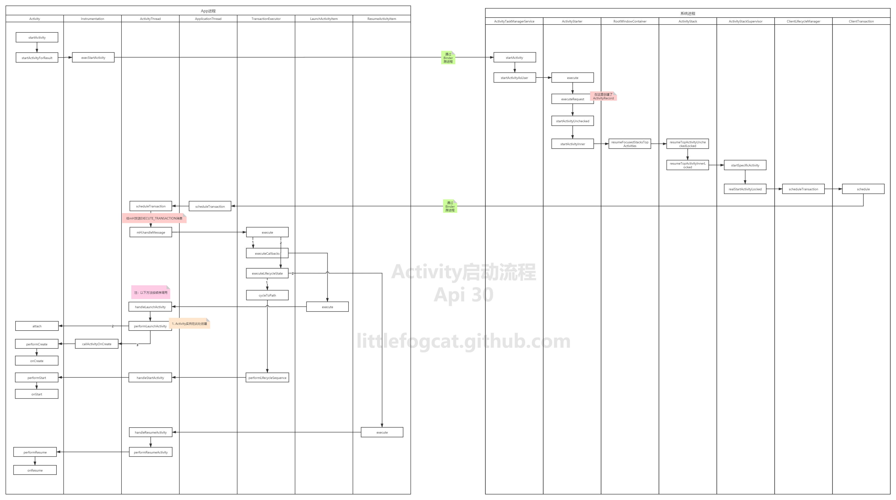

# app启动流程——基于Android11分析

前两天分析了Android系统的启动流程后，我们知道Android系统启动最终会走到Launcher，也就是我们所看见的”桌面“，app的启动是从用户点击桌面的icon开始的，当我们点击屏幕上的软件图标时，就可以打开这个软件，这个过程看似也很简单，其实中间包含了很多的底层交互，接下来，我会从源码角度一步一步分析这个流程，看了不明白的，欢迎来打我。。

## 启动流程一（Launcher）

我们手机桌面——Launcher其实也是一个app，我们所看见的是它的一个activity，里面是一个RecyclerView包裹着所有的应用图标，图标中包含安装apk时解析的应用默认启动页等信息，在点击应用图标时，即将要启动的App和Launcher、AMS、Zygote都运行在不同进程中，所以他们之间的通信是通过binder去完成的，所以AMS是必不可少的。下面我们通过源码来看下：

### Launcher向AMS发送启动Activity

当用户点击应用图标时，调用startActivitySafely方法：

***packages/apps/Launcher3/src/com/android/launcher3/Launcher.java***

```java
@Override
public boolean startActivitySafely(View v, Intent intent, ItemInfo item,
        @Nullable String sourceContainer) {
    if (!hasBeenResumed()) {
        
        addOnResumeCallback(() -> startActivitySafely(v, intent, item, sourceContainer));
        if (mOnDeferredActivityLaunchCallback != null) {
            mOnDeferredActivityLaunchCallback.run();
            mOnDeferredActivityLaunchCallback = null;
        }
        return true;
    }

    boolean success = super.startActivitySafely(v, intent, item, sourceContainer);
    if (success && v instanceof BubbleTextView) {
        
        BubbleTextView btv = (BubbleTextView) v;
        btv.setStayPressed(true);
        addOnResumeCallback(btv);
    }
    return success;
}
```

最终会走到startActivity中：

```java
@Override
public void startActivity(Intent intent) {
    this.startActivity(intent, null);
}

@Override
public void startActivity(Intent intent, @Nullable Bundle options) {
    if (mIntent != null && mIntent.hasExtra(AutofillManager.EXTRA_RESTORE_SESSION_TOKEN)
        && mIntent.hasExtra(AutofillManager.EXTRA_RESTORE_CROSS_ACTIVITY)) {
        if (TextUtils.equals(getPackageName(),
                             intent.resolveActivity(getPackageManager()).getPackageName())) {
            // Apply Autofill restore mechanism on the started activity by startActivity()
            final IBinder token =
                mIntent.getIBinderExtra(AutofillManager.EXTRA_RESTORE_SESSION_TOKEN);
            // Remove restore ability from current activity
            mIntent.removeExtra(AutofillManager.EXTRA_RESTORE_SESSION_TOKEN);
            mIntent.removeExtra(AutofillManager.EXTRA_RESTORE_CROSS_ACTIVITY);
            // Put restore token
            intent.putExtra(AutofillManager.EXTRA_RESTORE_SESSION_TOKEN, token);
            intent.putExtra(AutofillManager.EXTRA_RESTORE_CROSS_ACTIVITY, true);
        }
    }
    if (options != null) {
        //-1为requestCode表明不需要知道是否启动成功
        startActivityForResult(intent, -1, options);
    } else {
        startActivityForResult(intent, -1);
    }
}
```

调用startActivityForResult：进入看下

```java
public void startActivityForResult(@RequiresPermission Intent intent, int requestCode,
        @Nullable Bundle options) {
    if (mParent == null) {
        options = transferSpringboardActivityOptions(options);
        Instrumentation.ActivityResult ar =
            mInstrumentation.execStartActivity(
                this, mMainThread.getApplicationThread(), mToken, this,
                intent, requestCode, options);
      
        ...
            
    } else {
        
      ...
    }
}
```

每个activity都持有一个Instrumentation对象，这个函数中传入了mMainThread.getApplicationThread()，它获取到的是ActivityThread的内部类ApplicationThread，这是一个Binder对象，之后AMS通过此对象与app通信

```java
public ActivityResult execStartActivity(
        Context who, IBinder contextThread, IBinder token, Activity target,
        Intent intent, int requestCode, Bundle options) {
   ...
       
    try {
       
        int result = ActivityTaskManager.getService().startActivity(whoThread,
                who.getBasePackageName(), who.getAttributionTag(), intent,
                intent.resolveTypeIfNeeded(who.getContentResolver()), token,
                target != null ? target.mEmbeddedID : null, requestCode, 0, null, options);
       ...
    }
    return null;
}

public static IActivityTaskManager getService() {
    return IActivityTaskManagerSingleton.get();
}

@UnsupportedAppUsage(trackingBug = 129726065)
private static final Singleton<IActivityTaskManager> IActivityTaskManagerSingleton = new Singleton<IActivityTaskManager>() {
    @Override
    protected IActivityTaskManager create() {
        final IBinder b = ServiceManager.getService(Context.ACTIVITY_TASK_SERVICE);
        return IActivityTaskManager.Stub.asInterface(b);
    }
};
```

这一步Launcher开始向AMS通信，IActivityTaskManager是一个代理AMS端Binder的对象，之后AMS开始startActivity。 到这里Launcher向AMS请求启动一个Activity的流程就结束了。

## 启动流程二（AMS）

### AMS启动Activity

现在流程走到了AMS进程中，上面通过代理调用了ATMS的startActivity方法：

```java
@Override
public final int startActivity(IApplicationThread caller, String callingPackage,
                               String callingFeatureId, Intent intent, String resolvedType, IBinder resultTo,
                               String resultWho, int requestCode, int startFlags, ProfilerInfo profilerInfo,
                               Bundle bOptions) {
    return startActivityAsUser(caller, callingPackage, callingFeatureId, intent, resolvedType,
                               resultTo, resultWho, requestCode, startFlags, profilerInfo, bOptions,
                               UserHandle.getCallingUserId());
}

@Override
public int startActivityAsUser(IApplicationThread caller, String callingPackage,
                               String callingFeatureId, Intent intent, String resolvedType, IBinder resultTo,
                               String resultWho, int requestCode, int startFlags, ProfilerInfo profilerInfo,
                               Bundle bOptions, int userId) {
    return startActivityAsUser(caller, callingPackage, callingFeatureId, intent, resolvedType,
                               resultTo, resultWho, requestCode, startFlags, profilerInfo, bOptions, userId,
                               true /*validateIncomingUser*/);
}

private int startActivityAsUser(IApplicationThread caller, String callingPackage,
                                @Nullable String callingFeatureId, Intent intent, String resolvedType,
                                IBinder resultTo, String resultWho, int requestCode, int startFlags,
                                ProfilerInfo profilerInfo, Bundle bOptions, int userId, boolean validateIncomingUser) {
    assertPackageMatchesCallingUid(callingPackage);
    enforceNotIsolatedCaller("startActivityAsUser");

    userId = getActivityStartController().checkTargetUser(userId, validateIncomingUser,
                                                          Binder.getCallingPid(), Binder.getCallingUid(), "startActivityAsUser");

    // TODO: Switch to user app stacks here.
    return getActivityStartController().obtainStarter(intent, "startActivityAsUser")
        .setCaller(caller)
        .setCallingPackage(callingPackage)
        .setCallingFeatureId(callingFeatureId)
        .setResolvedType(resolvedType)
        .setResultTo(resultTo)
        .setResultWho(resultWho)
        .setRequestCode(requestCode)
        .setStartFlags(startFlags)
        .setProfilerInfo(profilerInfo)
        .setActivityOptions(bOptions)
        .setUserId(userId)
        .execute();

}
```

上面都是一些权限检查，通过一连串调用，走到了ActivityStarter里，调用了execute：

```java
int execute() {
    ...     
    res = executeRequest(mRequest);
    ...
}
```

```java
private int executeRequest(Request request) {
    
    ...
        
     mLastStartActivityResult = startActivityUnchecked(r, sourceRecord, voiceSession,
                request.voiceInteractor, startFlags, true /* doResume */, checkedOptions, inTask,
                restrictedBgActivity, intentGrants);

       ...
           
        return mLastStartActivityResult;
    }
```

接着调用了startActivityUnchecked方法，继续看这个方法：

```java
private int startActivityUnchecked(final ActivityRecord r, ActivityRecord sourceRecord,
            IVoiceInteractionSession voiceSession, IVoiceInteractor voiceInteractor,
            int startFlags, boolean doResume, ActivityOptions options, Task inTask,
            boolean restrictedBgActivity, NeededUriGrants intentGrants) {
    ...
        result = startActivityInner(r, sourceRecord, voiceSession, voiceInteractor,
                startFlags, doResume, options, inTask, restrictedBgActivity, intentGrants);
   
    ...

    return result;
}
```

```java
int startActivityInner(final ActivityRecord r, ActivityRecord sourceRecord,
        IVoiceInteractionSession voiceSession, IVoiceInteractor voiceInteractor,
        int startFlags, boolean doResume, ActivityOptions options, Task inTask,
        boolean restrictedBgActivity, NeededUriGrants intentGrants) {
    ...
        
    mRootWindowContainer.resumeFocusedStacksTopActivities(
                        mTargetStack, mStartActivity, mOptions);
    ...
}
```

```java
boolean resumeFocusedStacksTopActivities(
        ActivityStack targetStack, ActivityRecord target, ActivityOptions targetOptions) {

   ...
       
        if (!resumedOnDisplay) {
            final ActivityStack focusedStack = display.getFocusedStack();
            if (focusedStack != null) {
                result |= focusedStack.resumeTopActivityUncheckedLocked(target, targetOptions);
            } else if (targetStack == null) {
                result |= resumeHomeActivity(null /* prev */, "no-focusable-task",
                        display.getDefaultTaskDisplayArea());
            }
        }
    }

    return result;
}
```

这里会调用resumeTopActivityUncheckedLocked：

```java
boolean resumeTopActivityUncheckedLocked(ActivityRecord prev, ActivityOptions options) {
   
   ...
        result = resumeTopActivityInnerLocked(prev, options);
   ...

    return result;
}
```

继续走到resumeTopActivityInnerLocked：

```java
private boolean resumeTopActivityInnerLocked(ActivityRecord prev, ActivityOptions options) {
    ...
        if (mResumedActivity != null) {
       pausing |= startPausingLocked(userLeaving, false , next);
    }
    
        mStackSupervisor.startSpecificActivity(next, true, true);
    ...
}
```

startPausingLocked方法主要是通知Launcher进入Pause状态，在它进入这个状态后，在ActivityStackSupervisor的startSpecificActivity方法里判断新的app进程状态做出不同响应。一起看下这个方法：

```java
void startSpecificActivity(ActivityRecord r, boolean andResume, boolean checkConfig) {
    // 获取启动的activity进程信息
    final WindowProcessController wpc =
            mService.getProcessController(r.processName, r.info.applicationInfo.uid);

    boolean knownToBeDead = false;
    //如果进程存在，并且进程中有线程存在，就启动一个同应用的activity
    if (wpc != null && wpc.hasThread()) {
        try {
            realStartActivityLocked(r, wpc, andResume, checkConfig);
            return;
        } catch (RemoteException e) {
            Slog.w(TAG, "Exception when starting activity "
                    + r.intent.getComponent().flattenToShortString(), e);
        }

        // If a dead object exception was thrown -- fall through to
        // restart the application.
        knownToBeDead = true;
    }
	
    //否则通过AMS向Zygote进程请求创建新进程
    r.notifyUnknownVisibilityLaunchedForKeyguardTransition();

    final boolean isTop = andResume && r.isTopRunningActivity();
    mService.startProcessAsync(r, knownToBeDead, isTop, isTop ? "top-activity" : "activity");
}
```

到这里就完成了Launcher和AMS的通信、以及AMS和zygote的通信，接下来创建要启动的app的线程，也就是ActivityThread。

## 启动流程三（app）

### 新的进程启动

上面说到zygote启动新的进程时标记ActivityThread.main函数，在zygote创建好新进程后反射调用此方法，现在处于新的app进程中。

```java
public static void main(String[] args) {
   ...
       

    Looper.prepareMainLooper();

   ...
    ActivityThread thread = new ActivityThread();
    thread.attach(false, startSeq);
   
    ...

    Looper.loop();

}
```

```java
private void attach(boolean system, long startSeq) {
	...
        
        try {
            mgr.attachApplication(mAppThread, startSeq);
        } catch (RemoteException ex) {
            throw ex.rethrowFromSystemServer();
        }
        
        ...
    }
}
```

```java
@Override
public final void attachApplication(IApplicationThread thread, long startSeq) {
    synchronized (this) {
       ...
        attachApplicationLocked(thread, callingPid, callingUid, startSeq);
       ...
    }
}
```

```java
private boolean attachApplicationLocked(@NonNull IApplicationThread thread,
                                        int pid, int callingUid, long startSeq) {
    ...
        //1
        thread.bindApplication(processName, appInfo, providerList,
                               instr2.mClass,
                               profilerInfo, instr2.mArguments,
                               instr2.mWatcher,
                               instr2.mUiAutomationConnection, testMode,
                               mBinderTransactionTrackingEnabled, enableTrackAllocation,
                               isRestrictedBackupMode || !normalMode, app.isPersistent(),
                               new Configuration(app.getWindowProcessController().getConfiguration()),
                               app.compat, getCommonServicesLocked(app.isolated),
                               mCoreSettingsObserver.getCoreSettingsLocked(),
                               buildSerial, autofillOptions, contentCaptureOptions,
                               app.mDisabledCompatChanges);

    if (normalMode) {
        try {
            //2
            didSomething = mAtmInternal.attachApplication(app.getWindowProcessController());
        } catch (Exception e) {
            Slog.wtf(TAG, "Exception thrown launching activities in " + app, e);
            badApp = true;
        }
    }
}
```

这里主要创建了Looper和ActivityThread对象，然后将当前应用ApplicationThread注册到AMS中，ApplicationThread是ActivityThread的内部类实现了IApplicationThread.Stub用此对象可跨进程通信。

我们分两步看这个逻辑：

1、在AMS绑定ApplicationThread时，发送了一个H.BIND_APPLICATION的Message，在Handler中处理该消息时调用了Application的onCreate方法。

```java
@Override
public final void bindApplication(String processName, ApplicationInfo appInfo,
        ProviderInfoList providerList, ComponentName instrumentationName,
        ProfilerInfo profilerInfo, Bundle instrumentationArgs,
        IInstrumentationWatcher instrumentationWatcher,
        IUiAutomationConnection instrumentationUiConnection, int debugMode,
        boolean enableBinderTracking, boolean trackAllocation,
        boolean isRestrictedBackupMode, boolean persistent, Configuration config,
        CompatibilityInfo compatInfo, Map services, Bundle coreSettings,
        String buildSerial, AutofillOptions autofillOptions,
        ContentCaptureOptions contentCaptureOptions, long[] disabledCompatChanges) {
	...
        
    sendMessage(H.BIND_APPLICATION, data);
}
```

```java
public void handleMessage(Message msg) {
    if (DEBUG_MESSAGES) Slog.v(TAG, ">>> handling: " + codeToString(msg.what));
    switch (msg.what) {
        case BIND_APPLICATION:
            Trace.traceBegin(Trace.TRACE_TAG_ACTIVITY_MANAGER, "bindApplication");
            AppBindData data = (AppBindData)msg.obj;
            handleBindApplication(data);
            Trace.traceEnd(Trace.TRACE_TAG_ACTIVITY_MANAGER);
            break;
            ...
    }
}
```

```java
private void handleBindApplication(AppBindData data) {
    ...
     mInstrumentation.callApplicationOnCreate(app);
    ...
}
```

```java
//Application.java
public void onCreate() {
}
```

到这里为止，新的app线程已经启动并且绑定了Application

### 创建activity

2、在mAtmInternal的attachApplication中通过层层调用到ActivityStackSupervisor.realStartActivityLocked方法。

```java
boolean realStartActivityLocked(ActivityRecord r, WindowProcessController proc,
                                boolean andResume, boolean checkConfig) throws RemoteException {

    ...

        // 创建activity启动事务
        final ClientTransaction clientTransaction = ClientTransaction.obtain(
        proc.getThread(), r.appToken);

    final DisplayContent dc = r.getDisplay().mDisplayContent;
 	clientTransaction.addCallback(LaunchActivityItem.obtain(new Intent(r.intent),
                        System.identityHashCode(r), r.info,
                        mergedConfiguration.getGlobalConfiguration(),
                        mergedConfiguration.getOverrideConfiguration(), r.compat,
                        r.launchedFromPackage, task.voiceInteractor, proc.getReportedProcState(),
                        r.getSavedState(), r.getPersistentSavedState(), results, newIntents,
                        dc.isNextTransitionForward(), proc.createProfilerInfoIfNeeded(),
                        r.assistToken, r.createFixedRotationAdjustmentsIfNeeded()));

    // Set desired final state.
    final ActivityLifecycleItem lifecycleItem;
    if (andResume) {
        lifecycleItem = ResumeActivityItem.obtain(dc.isNextTransitionForward());
    } else {
        lifecycleItem = PauseActivityItem.obtain();
    }
    clientTransaction.setLifecycleStateRequest(lifecycleItem);

    //执行clientTransaction
    mService.getLifecycleManager().scheduleTransaction(clientTransaction);
    ...
}

```

ClientTransaction管理了activity的启动信息，通过ClientLifecycleManager执行，调用

scheduleTransaction方法，看下这个方法：

```java
void scheduleTransaction(ClientTransaction transaction) throws RemoteException {
    final IApplicationThread client = transaction.getClient();
    transaction.schedule();
    if (!(client instanceof Binder)) {
        transaction.recycle();
    }
}
```

调用了ClientTransaction类的schedule方法：

```java
public void schedule() throws RemoteException {
    mClient.scheduleTransaction(this);
}
```

mClient是一个IApplicationThread接口，上面我们也分析到，它的实现是ApplicationThread，而ApplicationThread是ActivityThread的内部类，我们进去看下：

```java
@Override
public void scheduleTransaction(ClientTransaction transaction) throws RemoteException {
    ActivityThread.this.scheduleTransaction(transaction);
}
```

ApplicationThread的scheduleTransaction方法其实是调用了ActivityThread的同名方法。而ActivityThread自身并没有定义这个方法，而是继承自父类ClientTransactionHandler：

```java
void scheduleTransaction(ClientTransaction transaction) {
    transaction.preExecute(this);
    sendMessage(ActivityThread.H.EXECUTE_TRANSACTION, transaction);
}
```

scheduleTransaction方法中发送了EXECUTE_TRANSACTION消息给ActivityThread的H类处理，H肯定是继承自Handler了，来看下：

```java
class H extends Handler {
    public void handleMessage(Message msg) {
        switch (msg.what) {
                ...
                case EXECUTE_TRANSACTION:
                final ClientTransaction transaction = (ClientTransaction) msg.obj;
                mTransactionExecutor.execute(transaction);
                if (isSystem()) {
                    transaction.recycle();
                }
                break;
                ...
        }
    }
}
```

通过handleMessage来处理这个消息，里面又调用了TransactionExecutor的execute方法：

```java
public void execute(ClientTransaction transaction) {
    ...
    executeCallbacks(transaction);
    executeLifecycleState(transaction);
    mPendingActions.clear();

}

public void executeCallbacks(ClientTransaction transaction) {
       final List<ClientTransactionItem> callbacks = transaction.getCallbacks();
       ...

        final int size = callbacks.size();
        for (int i = 0; i < size; ++i) {
            final ClientTransactionItem item = callbacks.get(i); 
            ...
            item.execute(mTransactionHandler, token, mPendingActions);  
        }
}

 private void executeLifecycleState(ClientTransaction transaction) {
        final ActivityLifecycleItem lifecycleItem = transaction.getLifecycleStateRequest();

     //生命周期的过渡
        cycleToPath(r, lifecycleItem.getTargetState(), true /* excludeLastState */, transaction);

        lifecycleItem.execute(mTransactionHandler, token, mPendingActions);
        lifecycleItem.postExecute(mTransactionHandler, token, mPendingActions);
 }
```

这里分别调用了executeCallbacks和executeLifecycleState，也就是事务Callback和LifecycleState的execute方法，这里的Callback和LifecycleState是在ActivityStackSupervisor的realStartActivityLocked流程创建的，分别对应的是LaunchActivityItem和ResumeActivityItem。来看下这两个execute方法：

```java
//LaunchActivityItem.java
    
public void execute(ClientTransactionHandler client, IBinder token,
        PendingTransactionActions pendingActions) {
   ...
    client.handleLaunchActivity(r, pendingActions, null /* customIntent */);
    
}
```

```java
//ResumeActivityItem.java

public void execute(ClientTransactionHandler client, IBinder token,
        PendingTransactionActions pendingActions) {
    ...
    client.handleResumeActivity(token, true /* finalStateRequest */, mIsForward,
            "RESUME_ACTIVITY");

}
```

可以看到这两个execute方法里都是调用了ClientTransactionHandler来处理activity的，而

ClientTransactionHandler是抽象类，最终又回到了ActivityThread类中，看下：

```java
public Activity handleLaunchActivity(ActivityClientRecord r,
     
	...
                                     
    final Activity a = performLaunchActivity(r, customIntent);

    return a;
}
```

```java
    private Activity performLaunchActivity(ActivityClientRecord r, Intent customIntent) {
        //获取activity信息
        ActivityInfo aInfo = r.activityInfo;
       
        //拿到启动activity的组件名
        ComponentName component = r.intent.getComponent();
        ...
            
        ContextImpl appContext = createBaseContextForActivity(r);
        Activity activity = null;
        try {
            java.lang.ClassLoader cl = appContext.getClassLoader();
            activity = mInstrumentation.newActivity(
                    cl, component.getClassName(), r.intent);
        }
        ...
           

        try {
            Application app = r.packageInfo.makeApplication(false, mInstrumentation);

           ...
               
                activity.attach(appContext, this, getInstrumentation(), r.token,
                        r.ident, app, r.intent, r.activityInfo, title, r.parent,
                        r.embeddedID, r.lastNonConfigurationInstances, config,
                        r.referrer, r.voiceInteractor, window, r.configCallback,
                        r.assistToken);

                int theme = r.activityInfo.getThemeResource();
                if (theme != 0) {
                    activity.setTheme(theme);
                }

            ...
                activity.mCalled = false;
                if (r.isPersistable()) {
                    mInstrumentation.callActivityOnCreate(activity, r.state, r.persistentState);
                } else {
                    mInstrumentation.callActivityOnCreate(activity, r.state);
                }
               
            ...
        return activity;
    }
```

梳理下这个方法做了哪些事情：

- 创建启动activity的上下文环境
- 通过Instrumentation的newActivity方法，以反射形式创建activity实例
- 如果Application不存在的话会创建Application并调用Application的onCreate方法
- 初始化activity，通过Activity的attach方法，实例化Window对象，并实现Activity和Window相关联
- 通过Instrumentation调用activity的**onCreate**方法

与handleLaunchActivity类似的，handleResumeActivity则是调用了performResumeActivity方法。其大体上依次做了：

- 如果需要，调用待Resume Activity的onNewIntent、onActivityResult回调；
- 调用Activity的performResume方法，其中调用了**onResume**回调；

这样，app就启动完成了。

最后，给大家看下整体的流程图（其实是从网上盗的图.......哈哈）



## 总结

通过上面的分析，我们基本把app启动流程走完了，看起来比较复杂，其实通过整体分析，还是能走通的，遇到流程不通时，也可以debug。

- 点击图标，Launcher向AMS请求启动app
- AMS收到请求后，记录app的信息，并告知Launcher进入pause状态
- Launcher进入pause状态后，告知AMS
- AMS检测新的app进程时候已经启动，否则通过Zygote创建新的进程并启动ActivityThread的main方法
- 进程创建好后，调用上面的ActivityThread.main()
- ActivityThread中H处理需要启动Activity的请求消息

本人能力有限，在分析过程中，代码有所删减，如果文章中有写得不对的地方，欢迎在留言区留言大家一起讨论，共同学习进步。如果觉得我的文章给予你帮助，也请给我一个喜欢和关注。

