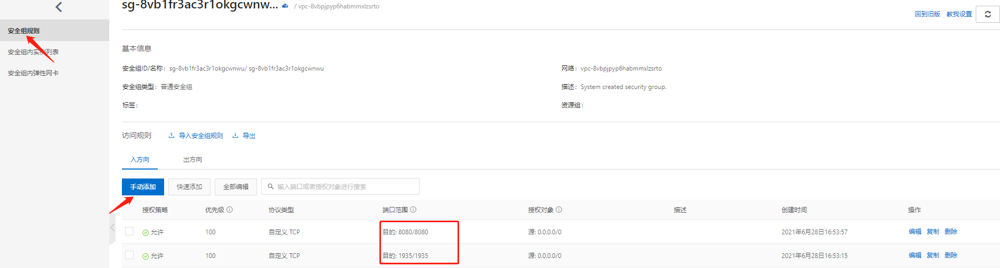
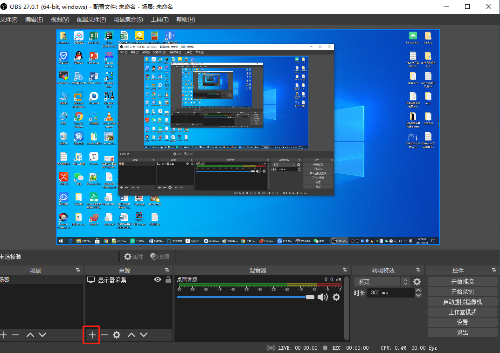
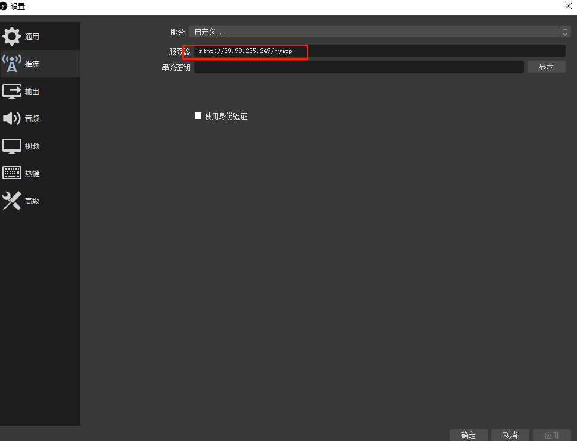
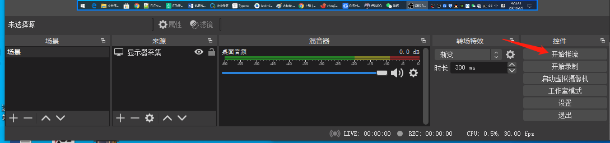
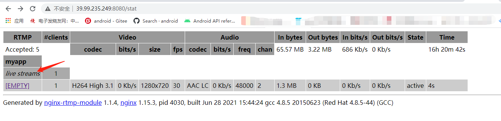
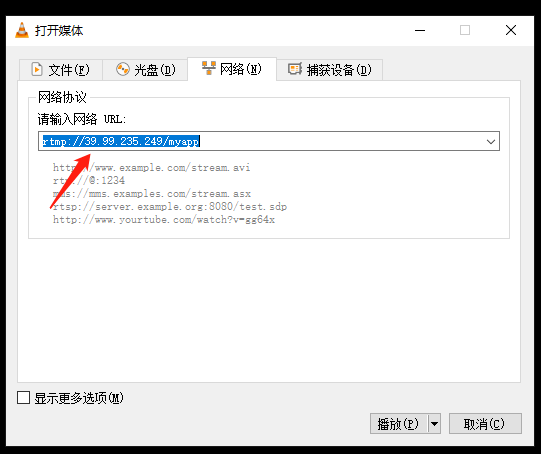

# 流媒体服务器搭建

## 一、服务器搭建

### 1.下载nginx并解压：

```bash
wget http://nginx.org/download/nginx-1.15.3.tar.gz

tar xvf nginx-1.15.3.tar.gz
```

### 2.下载rtmp-module模块并解压：

```bash
wget https://codeload.github.com/arut/nginx-rtmp-module/tar.gz/v1.2.1

tar xvf v1.2.1
```

### 3.进入nginx目录：

```bash
cd nginx-1.15.3

执行下面命令：--prefix=生成结果路径   --add-module=管理rtmp模块
./configure --prefix=./bin --add-module=../nginx-rtmp-module-1.2.1
```

如果执行过程中，报以下错误：

```ABAP
./configure: error: the HTTP rewrite module requires the PCRE library.
You can either disable the module by using --without-http_rewrite_module
option, or install the PCRE library into the system, or build the PCRE library
statically from the source with nginx by using --with-pcre=<path> option.
```

说明缺少依赖包，centos用yum命令安装，ubuntu用apt install安装。

```bash
yum -y install zlib zlib-devel openssl openssl--devel pcre pcre-devel
```

不同的系统版本列出的安装包版本不同，可通过 `yum search 依赖包`  来查看。

### 4.上面步骤成功后，会在nginx目录下生成Makefile文件，执行编译：

```bash
make install
```

### 5.编译完成后，会在/usr/local/nginx目录下生成以下文件：


### 6.进入conf目录，修改nginx.conf文件：

```bash
#如果不加，启动nginx服务器就会报错，权限被拒绝
user root;

worker_processes 1;

#如果启动错误，这个就是错误日志详情
error_log logs/error.log debug;

events {
	worker_connections 1024;
}

rtmp {
	server {
		#注意端口占用  流媒体服务器的端口
		listen 1935;
		

		#如果不加，可能会失败
		application myapp {
			live on;
			#丢弃闲置5s的连接
			drop_idle_publisher 5s;
		}
	}

}

#下面就是为了测试 http://139.224.136.101:8080/stat 控制面板的意思
http {
	server {
		#注意端口占用
		listen 8080;
		location /stat {
			rtmp_stat all;
			rtmp_stat_stylesheet stat.xsl;
		}
		

		location /stat.xsl
		{ 
			#注意目录
			root /root/workspace/nginxServer/nginx-rtmp-module-1.2.1/;
		}
		
		location /control
		{ 
			rtmp_control all;
		}
		
		location /rtmp-publisher
		{ 
			#注意目录
			root /root/workspace/nginxServer/nginx-rtmp-module-1.2.1/test;
		}
		
		location / {
			#注意目录
			root /root/workspace/nginxServer/nginx-rtmp-module-1.2.1/test/www;
		}
	}

}
```

### 7.进入nginx根目录，执行

```bash
/usr/local/nginx/sbin/nginx
```

解决端口被占用问题

```ABAP
nginx: [emerg] bind() to 0.0.0.0:1935 failed (98: Address already in use)
nginx: [emerg] bind() to 0.0.0.0:8080 failed (98: Address already in use)
nginx: [emerg] bind() to 0.0.0.0:1935 failed (98: Address already in use)
nginx: [emerg] bind() to 0.0.0.0:8080 failed (98: Address already in use)
nginx: [emerg] bind() to 0.0.0.0:1935 failed (98: Address already in use)
nginx: [emerg] bind() to 0.0.0.0:8080 failed (98: Address already in use)
nginx: [emerg] bind() to 0.0.0.0:1935 failed (98: Address already in use)
nginx: [emerg] bind() to 0.0.0.0:8080 failed (98: Address already in use)
nginx: [emerg] bind() to 0.0.0.0:1935 failed (98: Address already in use)
nginx: [emerg] bind() to 0.0.0.0:8080 failed (98: Address already in use)
nginx: [emerg] still could not bind()
```

需要安装lsof工具来查看被占用端口

```bash
yum install lsof
```

执行命令查看哪些端口被占用：

```bash
lsof -i :8080
```

```bash
#依次结束占用端口的进程
kill -9 pid 
```

排查端口没有任何进程占用后，再次启动nginx

```bash
/usr/local/nginx/sbin/nginx
```

**在安全组添加配置规则，打开8080端口和1935端口**



至此，流媒体服务器搭建完成，直接访问即可：

http://ip:8080/stat

接下来就可以进行推流了。

## 二、使用obs studio进行推流

上面我们把流媒体服务器搭建好以后，我们使用OBS Studio可以实现简单的推流。

1.下载OBS Studio，https://obsproject.com/zh-cn/download

2.打开obs studio后，点击来源中的＋号

选择显示器采集，就会把我们显示屏的界面添加进去。

3.在文件----->设置------>推流 中选择自定义服务，服务器就是我们刚刚搭建好的服务器，但是这里需要用rtmp来进行推流



4.点击确定后，就可以进行推流了。



5.在浏览器界面打开服务器，就可以看见我们推上去的流了。



6.用VLC播放器，通过网络串流 输入我们的rtmp流地址，就可以进行拉流了。



